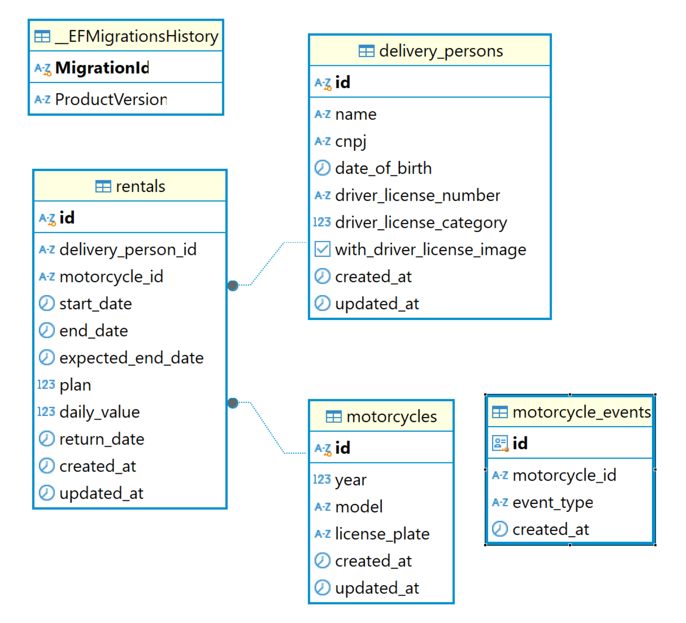
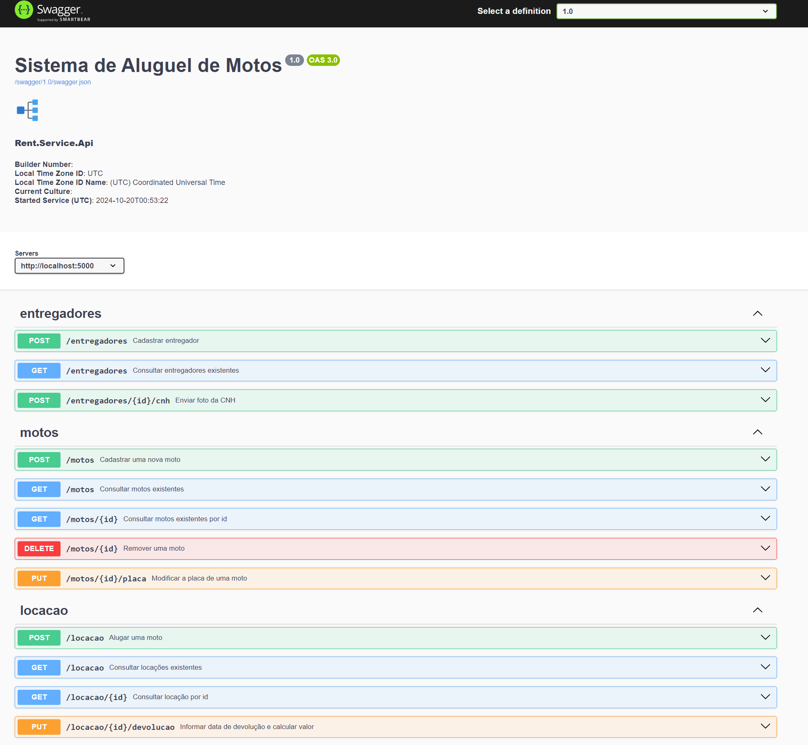

---

# Gerenciador de Aluguel de Motos

---

## Introdução
Este projeto tem como objetivo implementar uma POC de aplicação para gerenciar o aluguel de motos e entregadores.

---

## Conteúdo
- [Requisitos](#requisitos)
- [Casos de Uso](#casos-de-uso)
- [Estrutura do Projeto](#estrutura-do-projeto)
- [Executando no Docker](#executando-no-docker)

---

## Requisitos

### Tecnologias Utilizadas
- **.NET 8 C#**
- **PostgreSQL**
- **RabbitMQ**
- **MinIO**
- **Seq**

### Arquitetura e Design
A aplicação segue os princípios de **Clean Architecture** e adota o padrão **CQRS** para separar operações de leitura e escrita. Utiliza **Unit of Work (UoW)** com **Entity Framework Core** para gerenciar transações, e **MediatR** para comunicação entre componentes.

- **CQRS**: Implementado com **MediatR**.
- **Repository e Unit of Work**: Utilizando **Entity Framework Core** e **NetToolsKit**.
- **Mensageria (RabbitMQ)**: Gerenciado com **MassTransit**.
- **Validação**: Feita com **FluentValidator**.
- **Mapeamento de Objetos**: Usando **AutoMapper**.
- **Monitoramento e Logs**: Implementado com **Serilog** e visualizado no **Seq**.
- **Testes de Integração**: Utilizando **Ductus.FluentDocker**.
- **Testes Unitários**: Realizados com **XUnit**, **NUnit**, e **FluentAssertions**.

### Boas Práticas de Desenvolvimento
- ✅ **Testes Unitários**: Garantir a funcionalidade correta dos componentes isoladamente.
- ✅ **Testes de Integração**: Validar a comunicação entre diferentes módulos do sistema.
- ✅ **Uso de Docker**: Facilitar a configuração de ambientes e garantir consistência na execução.
- ✅ **Clean Code**: Manter o código limpo, legível e fácil de entender.
- ✅ **Padrões de Projeto**: Aplicar Design Patterns (CQRS, Repository, UoW) para uma estruturação eficiente.
- ✅ **Tratamento de Erros**: Gerenciar exceções adequadamente, fornecendo logs claros e úteis.
- ✅ **Validação de Entrada**: Usar ferramentas como FluentValidation para garantir a integridade dos dados.
- ✅ **Documentação**: Manter uma documentação clara e atualizada para facilitar o entendimento e a manutenção.

---

## Casos de Uso

1. **Administração de Motos**:
   - Cadastrar nova moto com dados obrigatórios (Identificador, Ano, Modelo, Placa).
        - A placa é um dado único e não pode se repetir.
        - Quando a moto for cadastrada a aplicação deverá gerar um evento de moto cadastrada.
        - A notificação deverá ser publicada por mensageria.
        - Assim que a mensagem for recebida, deverá ser armazenada no banco de dados para consulta futura.
   - Consultar motos filtrando pela placa.
   - Modificar placa de moto cadastrada.
   - Remover moto sem registros de locações.

2. **Cadastro de Entregadores**:
   - Cadastrar entregador com dados únicos (Identificador, Nome, CNPJ, Data de Nascimento, CNH, Tipo de CNH, Imagem da CNH).
        - Os tipos de cnh válidos são A, B ou ambas A+B.
        - O cnpj é único e não pode se repetir.
        - O número da CNH é único e não pode se repetir.
   - Atualizar foto da CNH (armazenar em serviço de storage).
        - O formato do arquivo deve ser png ou bmp.
        - A foto não poderá ser armazenada no banco de dados, deve utilizar um serviço de storage.

3. **Locação de Motos**:
   - Locar moto por períodos (7, 15, 30, 45 ou 50 dias).
   - Os planos disponíveis para locação são:
        - 7 dias com um custo de R$30,00 por dia
        - 15 dias com um custo de R$28,00 por dia
        - 30 dias com um custo de R$22,00 por dia
        - 45 dias com um custo de R$20,00 por dia
        - 50 dias com um custo de R$18,00 por dia
   - A locação obrigatóriamente tem que ter uma data de inicio e uma data de término e outra data de previsão de término.
   - O inicio da locação obrigatóriamente é o primeiro dia após a data de criação, ou seja, as 00:00 do primeiro após a data de criação.
   - Somente entregadores habilitados na categoria A podem efetuar uma locação.
   - Consultar valor total da locação com possibilidade de multa por devolução antecipada ou atraso.
        - Quando a data informada for inferior a data prevista do término, será cobrado o valor das diárias e uma multa adicional
            - Para plano de 7 dias o valor da multa é de 20% sobre o valor das diárias não efetivadas.
            - Para plano de 15 dias o valor da multa é de 40% sobre o valor das diárias não efetivadas.
        - Quando a data informada for superior a data prevista do término, será cobrado um valor adicional de R$50,00 por diária adicional.

### Estrutura do Banco de Dados
A imagem abaixo apresenta uma representação visual da estrutura do banco de dados do sistema de aluguel de motos. 



### Endpoints da API (Swagger)
Abaixo está uma captura de tela dos endpoints disponíveis da API, conforme documentado no Swagger:



---

## Estrutura do Projeto

### Nível Raiz da Solução
- **docker/**: Contém arquivos `docker-compose.yml` que configuram serviços da aplicação no ambiente Docker, como banco de dados, mensageria, e armazenamento.
- **.env**: Armazena variáveis de ambiente para configurar serviços Docker sem expor informações sensíveis.
- **Directory.Build.props**: Define configurações globais de build, como versões de pacotes, para todos os projetos.
- **NuGet.config**: Gerencia pacotes e fontes de dependências do projeto.

### Estrutura de Diretórios

**src/**:
- **Rent.Service.Api**: API RESTful que expõe os endpoints da aplicação.
- **Rent.Service.Application**: Contém a lógica de negócios e casos de uso.
- **Rent.Service.Domain**: Modelo de domínio, entidades e regras de negócio.
- **Rent.Service.Infrastructure**: Gestão de infraestrutura, banco de dados e serviços externos.
- **Rent.Service.Worker**: Serviços de background e processamento assíncrono.

**tests/**:
- **Rent.Service.Integration.Test**: Testes de integração entre componentes.
- **Rent.Service.Unit.Test**: Testes unitários para validar a lógica de classes e métodos.

---

## Executando no Docker

### Variáveis de Ambiente (.env)
O arquivo `.env` contém as variáveis de ambiente para configurar os serviços. 
Aqui estão os principais itens:

- **PostgreSQL Configurações**:
  - `SQL_HOST=postgres-server`
  - `SQL_DATABASE=RentTestDb`
  - `SQL_USERNAME=postgres`
  - `SQL_PASSWORD=NetToolsKit.Pass!`

- **RabbitMQ Configurações**:
  - `RABBITMQ_USERNAME=services`
  - `RABBITMQ_PASSWORD=NetToolsKit.Pass!`
  - `RABBITMQ_DEFAULT_USER=admin`
  - `RABBITMQ_DEFAULT_PASS=NetToolsKit.Pass!`
  - `RABBITMQ_HOST=rabbitmq`

- **MinIO Configurações**:
  - `MINIO_ROOT_USER=admin`
  - `MINIO_ROOT_PASSWORD=NetToolsKit.Pass!`
  - `MINIO_ROOT_ENDPOINT=minio:9000`

- **Seq Configurações**:
  - `SEQ_FIRSTRUN_ADMINPASSWORD=NetToolsKit.Pass!`
  - `SEQ_SERVER_URL=http://seq:5341`

### Comandos para Executar
Para executar a aplicação, utilize os seguintes comandos no diretório raiz:

```bash
# Construir e executar os serviços no Docker
docker compose -f docker/docker-compose.yml up -d
```

### Acessando os Serviços

- **API**: [localhost:5000/index.html](http://localhost:5000/index.html)

- **SEQ**: [localhost:8082](http://localhost:8082/#/login)  
  **Usuário**: admin  
  **Senha**: NetToolsKit.Pass!

- **MinIO**: [localhost:9006](http://localhost:9006/login)  
  **Usuário**: admin  
  **Senha**: NetToolsKit.Pass!

- **RabbitMQ**: [localhost:15672](http://localhost:15672/#/)  
  **Usuário**: admin  
  **Senha**: NetToolsKit.Pass!

- **PostgreSQL**:  
  **Usuário**: postgres  
  **Senha**: NetToolsKit.Pass!  
  **Banco de Dados**: RentTestDb

--- 